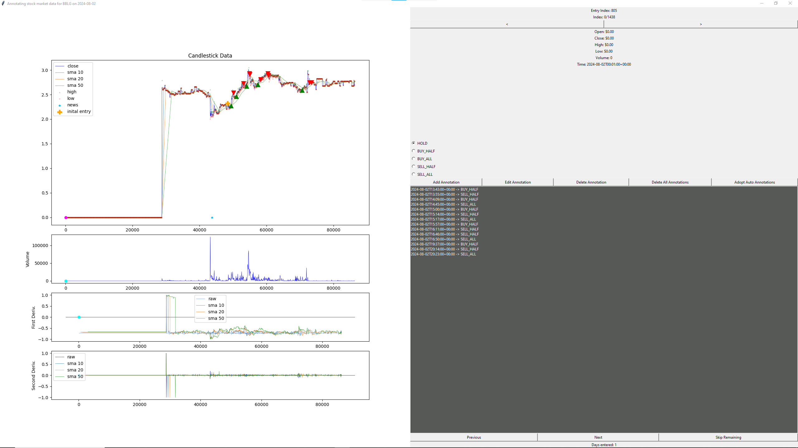

# Pystonks
This project aims to automate day trading on the stock market using AI.

# Installation
There are two steps to installing this project:

## Install Pytorch
Pytorch has its own step since there are several variants that you might want to install, 
you can find documentation on that here: 
[https://pytorch.org](https://pytorch.org/get-started/locally/). If you don't install a specific
variant, then the cpu variant will be installed by default when you install the requirements file in the next step.

## Install the requirements file
Run this from the root folder of the project to install the general dependencies. 
(__NOTE__: On debian based linux systems, like Ubuntu, you probably need to install `python3-tk` before installing the requirements 
file, you will also need to install the `livxcb-cursor0` package so that qt will work correctly)
```commandline
pip install -r ./requirements.txt
```

## Setup Config File
The project needs to know the keys and secrets for various APIs and a `config.json`
is the best way to do that. You need to create a `config.json` in the root of the
repository that looks something like this:

```json
{
  "alpaca_key": "your alpaca key",
  "alpaca_secret": "your alpaca secret",
  "polygon_key": "your polygon key",
  "finnhub_key": "your finnhub key", 
  "db_location": "the absolute path of where you'd like the database to be",
  "paper": true // or false
}
```

# Usage
This package has 4 stages:
1. The annotation stage
2. The training stage
3. The evolution stage
4. The deployment stage

# Annotations
While the overall goal is to evolve an AI to trade stocks. 
The complexity of the problem-space is too vast for strictly using a GA.
A solution to this is to take advantage of jump-starting the algorithm with a pretrained population.
Therefore, the first step of the project is to train an initial population for the GA.
The first step of training a supervised model is creating an annotated dataset.

The [`pystonks.supervised.annotations.annotator.py`](./pystonks/supervised/annotations/annotator.py) contains everything you need to annotate data.
Currently, the program is split between both the terminal and a gui.
The annotator does a simple sequence:
1. It fetches the list of ticker symbols, then applies static filters if any.
2. It filters the list of ticker symbols for the given date
3. For each of the symbols it updates the gui so that you can annotate with the actions.
4. It moves 1 day back in the past and repeats back to step 2

The gui looks like this:


On the left side of the gui are the following:
1. The main window, displays the Candlestick data for the given stock on the given day.
2. Under that is a line chart displaying the volume of trading
3. Under that is the discrete first derivative of the data in the main window
4. Under that is the discrete second derivative of the data in the main window

On the right side of the gui are the following:
1. Entry Index displays the index that the AI will begin to see data at, it is inclusive.
2. Current Index displays the currently selected index, signified by a pink dot on the main window on the left
3. There are two buttons `<` and `>` that allow you to increment and decrement the selected index.
4. There is a list of stats that correspond to the selected data in the windows on the left.
5. There is a list of possible actions that can be annotated.
6. A row of buttons for CRUD methods of annotations.
   1. Add, Edit, Delete Annotations are self-explanatory
   2. Delete all annotations deletes all of the annotations for the current symbol on the current day.
   3. Adopt Auto Annotations converts the automatically created annotations into real annotations. You can see more about this below.
7. What follows the buttons is a list of current annotations. You can select from this list when editing, or deleting.
8. Under the list of annotations is navigation buttons for going forward and backward between tickers on the current day.
   1. The Skip remaining allows you to skip the rest of the tickers for the current day and moves to the next day.

## Customization
You can customize just about every aspect of the program for annotating. 
You can modify the static filters, the screening filters, and the automatic annotations.
By default, the program uses a static float shares filter, a changes since news filter, and a peak annotator.

You can also modify the metrics that are displayed. By default, the EMA 12, EMA 26, MACD, and Signal line are displayed.
There are custom classes that you can inherit from to create your own metrics. 
The way that it works, the program contains a dictionary with regular expressions and metric setup functions.
The program then compares the list of arguments passed in to these regular expressions and the first one that matches
is created. To change the metrics that are displayed on the annotator you can pass them to the `--metrics` argument.
You can view the current regular expressions that are accepted by using `--metric_list`.

# Training
Now that you've created a dataset, it's time to train the supervised model.

Just like for annotating, there is a script for training models in [pystonks.supervised.training.trainer.py](./pystonks/supervised/training/trainer.py).
It outputs a pytorch model in location of the `--out` argument.

# Evolution
Now that you've created a trained supervised model, 
it's time to take that model and use it as an initial population for the GA.

WIP

# Deployment
We have created an AI to buy and sell stocks. It's time to test it with a simulated trader, and if it works. 
Deploy to the real market!

WIP
